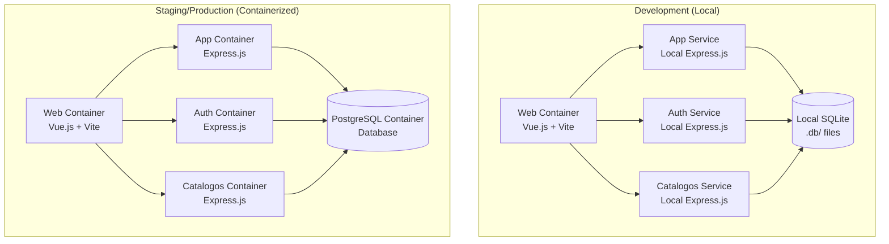

# Containerization Design Document

## Overview

This design outlines the containerization strategy for the Chinook music database administration application. The solution will transform the current multi-service architecture into a fully containerized system using Docker and Docker Compose, maintaining development workflow simplicity while enabling production-ready deployments.

The current architecture consists of:
- **Frontend**: Vue.js 3 application (web/) running on Vite dev server
- **Backend Services**: Three Express.js microservices (app, auth, catalogos)
- **Database Layer**: SQLite with Knex.js migrations (database/)
- **Shared Components**: Middleware and utilities (share/)

## Architecture

### Container Strategy

The application will be containerized using different strategies per environment:

**Development Environment**:
- Backend services run locally (non-containerized) with SQLite3
- Only web frontend containerized for consistency
- Database files stored locally in `.db/` directory

**Staging/Production Environments**:
- Full containerization with PostgreSQL database container
- All services containerized for environment parity
- Database persistence via Docker volumes



### Service Communication

**Development Environment**:
- Web container communicates with local backend services via host network
- Backend services access local SQLite files directly
- No internal Docker networking for backend services

**Staging/Production Environments**:
- **Internal Network**: All containers communicate via Docker internal network
- **Port Mapping**: Only web service exposed externally
- **Service Discovery**: Services reference each other by container names
- **Database Access**: PostgreSQL container with persistent volumes

## Components and Interfaces

### 1. Web Service Container

**Base Image**: `node:24-alpine`
**Purpose**: Serve Vue.js frontend application

**Multi-stage Build**:
```dockerfile
# Development stage
FROM node:24-alpine as development
WORKDIR /app
COPY package*.json ./
RUN npm ci
COPY . .
EXPOSE 5173
CMD ["npm", "run", "dev"]

# Production stage  
FROM node:24-alpine as production
WORKDIR /app
COPY package*.json ./
RUN npm ci --only=production
COPY . .
RUN npm run build
EXPOSE 80
CMD ["npm", "run", "preview"]
```

**Environment Variables**:
- `VITE_MODE`: Environment mode (desarrollo/staging/production)
- `VITE_BASE_URL`: API base URL
- `VITE_URL_AUTH`: Authentication service URL

### 2. Backend Service Containers (App, Auth, Catalogos)

**Base Image**: `node:24-alpine`
**Purpose**: Run Express.js microservices

**Multi-stage Build Pattern**:
```dockerfile
# Development stage
FROM node:24-alpine as development
WORKDIR /app
COPY package*.json ./
RUN npm ci
COPY . .
EXPOSE 3000
CMD ["npm", "run", "dev"]

# Production stage
FROM node:24-alpine as production
WORKDIR /app
COPY package*.json ./
RUN npm ci --only=production
COPY . .
EXPOSE 3000
CMD ["npm", "start"]
```

**Shared Configuration**:
- Health check endpoints at `/health`
- Graceful shutdown handling
- Environment-based configuration loading

### 3. Database Services

**Development**: 
- Local SQLite files (no containerization needed)
- Migrations run via local npm scripts

**Staging/Production PostgreSQL Container**:
```dockerfile
FROM postgres:16-alpine
ENV POSTGRES_DB=chinook
ENV POSTGRES_USER=chinook_user
ENV POSTGRES_PASSWORD=secure_password
COPY init-scripts/ /docker-entrypoint-initdb.d/
```

**Database Migration Service** (Staging/Production):
```dockerfile
FROM node:24-alpine
WORKDIR /app
COPY database/ .
RUN npm ci
# Wait for PostgreSQL to be ready
CMD ["sh", "-c", "dockerize -wait tcp://postgres:5432 -timeout 30s && npm run migrate-app && npm run migrate-auth && npm run migrate-cat"]
```

## Data Models

### Volume Management

**Development Environment**:
- **Local Database**: SQLite files remain in local `.db/` directory
- **Web Source Code**: Volume mount for Vue.js hot reload
- **No Backend Volumes**: Backend services run locally

**Staging/Production Environments**:
- **PostgreSQL Volume**: `chinook_pg_data` for database persistence
- **Application Volumes**: Separate volumes for each service's data
- **Configuration Volumes**: Environment-specific config files

### Environment Configuration

**Development Environment**:
```yaml
services:
  web:
    environment:
      - VITE_MODE=desarrollo
      - VITE_BASE_URL=http://host.docker.internal:3001
      - VITE_URL_AUTH=http://host.docker.internal:3000
    extra_hosts:
      - "host.docker.internal:host-gateway"
```

**Staging Environment**:
```yaml
services:
  web:
    environment:
      - VITE_MODE=staging
      - VITE_BASE_URL=http://app:3001
      - VITE_URL_AUTH=http://auth:3000
  
  auth:
    environment:
      - CORS_ORIGIN=http://web:5173
      - JWT_SECREAT_KEY=${JWT_SECRET}
      - PORT=3000
      - NODE_ENV=staging
      - DB_HOST=postgres
      - DB_NAME=chinook_auth
      - DB_USER=${DB_USER}
      - DB_PASSWORD=${DB_PASSWORD}
  
  app:
    environment:
      - CORS_ORIGIN=http://web:5173
      - JWT_SECREAT_KEY=${JWT_SECRET}
      - PORT=3001
      - NODE_ENV=staging
      - DB_HOST=postgres
      - DB_NAME=chinook_app
      - DB_USER=${DB_USER}
      - DB_PASSWORD=${DB_PASSWORD}
  
  postgres:
    environment:
      - POSTGRES_DB=chinook
      - POSTGRES_USER=${DB_USER}
      - POSTGRES_PASSWORD=${DB_PASSWORD}

**Production Environment**:
```yaml
services:
  web:
    environment:
      - VITE_MODE=production
      - VITE_BASE_URL=http://app:3001
      - VITE_URL_AUTH=http://auth:3000
  
  # Similar to staging but with production-specific settings
```

## Error Handling

### Container Health Checks

**Backend Services Health Check**:
```dockerfile
HEALTHCHECK --interval=30s --timeout=3s --start-period=5s --retries=3 \
  CMD curl -f http://localhost:${PORT}/health || exit 1
```

**Web Service Health Check**:
```dockerfile
HEALTHCHECK --interval=30s --timeout=3s --start-period=5s --retries=3 \
  CMD curl -f http://localhost:5173/ || exit 1
```

### Startup Dependencies

**Service Dependency Chain**:
1. Database migration service runs first
2. Backend services wait for database availability
3. Web service starts after backend services are healthy

**Implementation using Docker Compose**:
```yaml
services:
  db-migrate:
    # Migration service configuration
    
  auth:
    depends_on:
      db-migrate:
        condition: service_completed_successfully
        
  app:
    depends_on:
      db-migrate:
        condition: service_completed_successfully
        
  web:
    depends_on:
      - auth
      - app
```

### Error Recovery

**Restart Policies**:
- **Development**: `restart: "no"` (for debugging)
- **Production**: `restart: unless-stopped`

**Graceful Shutdown**:
- Signal handling in Node.js applications
- Connection draining before container termination
- Database connection cleanup

## Testing Strategy

### Container Testing

**Unit Tests**:
- Run within service containers during build
- Separate test stage in multi-stage builds
- Test database connections and API endpoints

**Integration Tests**:
- Docker Compose test configuration
- End-to-end testing with Playwright in containers
- Service communication testing

**Test Execution**:
```dockerfile
# Test stage
FROM development as test
RUN npm run test
```

### Development Testing

**Hot Reload Testing**:
- Volume mounts for source code
- Nodemon and Vite dev server in containers
- Test file watching and execution

**Database Testing**:
- Separate test database volume
- Migration testing in isolated containers
- Data persistence validation

## Implementation Phases

### Phase 1: Basic Containerization
- Create Dockerfiles for each service
- Implement basic Docker Compose configuration
- Ensure services start and communicate

### Phase 2: Development Workflow
- Add volume mounts for hot reload
- Implement database migration automation
- Create development-specific configurations

### Phase 3: Production Optimization
- Implement multi-stage builds
- Add health checks and monitoring
- Optimize image sizes and security

### Phase 4: Environment Management
- Create environment-specific compose files
- Implement configuration management
- Add deployment automation

## Security Considerations

**Image Security**:
- Use official Node.js Alpine images
- Regular security updates
- Minimal attack surface

**Network Security**:
- Internal Docker network isolation
- Expose only necessary ports
- Environment-specific CORS configuration

**Secret Management**:
- Environment variable injection
- Docker secrets for production
- No hardcoded credentials in images