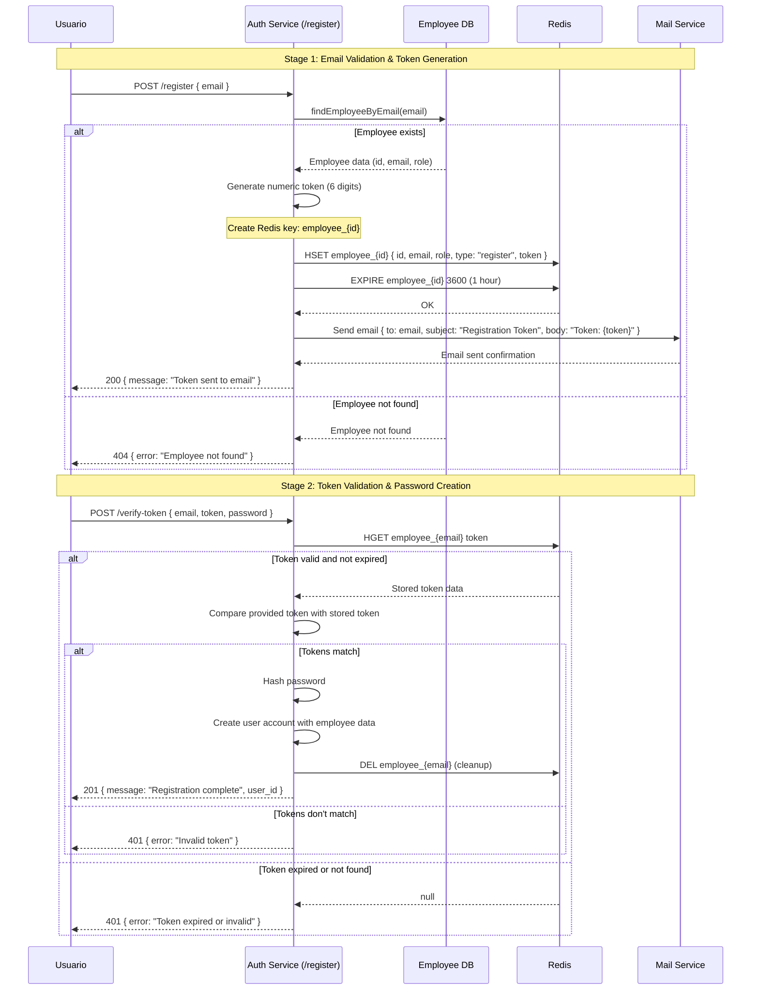

# Design Document

## Overview

The employee registration system implements a two-stage verification process where existing employees can register for platform access. The system validates employee existence by email, generates and sends a numeric verification token, and allows password creation upon successful token validation.

## Architecture

The registration process involves four main components:
- **User Interface**: Initiates registration requests
- **Auth Service**: Handles registration logic and validation
- **Mail Service**: Sends verification tokens via email
- **Redis**: Stores temporary verification tokens and session data

## Sequence Diagram



## Components and Interfaces

### Auth Service Endpoints

#### POST /register
- **Input**: `{ email: string }`
- **Process**: 
  - Validate employee exists by email
  - Generate 6-digit numeric token
  - Store token in Redis with employee data
  - Send token via mail service
- **Output**: `{ message: "Token sent to email" }` or error

#### POST /verify-token  
- **Input**: `{ email: string, token: string, password: string }`
- **Process**:
  - Retrieve and validate token from Redis
  - Hash password
  - Create user account
  - Clean up Redis token
- **Output**: `{ message: "Registration complete", user_id }` or error

### Redis Data Structure

```javascript
// Key: employee_{employee_id}
{
  id: employee.id,
  email: employee.email, 
  role: employee.role,
  type: "register",
  token: "123456", // 6-digit numeric
  expires: 3600 // 1 hour TTL
}
```

### Mail Service Integration

```javascript
// Mail payload
{
  to: employee.email,
  subject: "Platform Registration - Verification Token",
  body: `Your verification token is: ${token}. This token expires in 1 hour.`
}
```

## Data Models

### Employee (Existing Table)
```javascript
{
  id: number,
  email: string,
  role: string,
  // other employee fields...
}
```

### User (To be created)
```javascript
{
  id: number,
  employee_id: number, // FK to employee
  email: string,
  password_hash: string,
  role: string,
  created_at: timestamp,
  is_active: boolean
}
```

## Error Handling

### Registration Errors
- **Employee not found**: 404 with clear message
- **Employee already registered**: 409 conflict
- **Mail service failure**: 500 with retry mechanism
- **Redis connection failure**: 500 with fallback

### Token Validation Errors  
- **Invalid token**: 401 unauthorized
- **Expired token**: 401 with re-registration option
- **Missing token**: 400 bad request
- **Password validation failure**: 400 with requirements

## Testing Strategy

### Unit Tests
- Employee email validation logic
- Token generation and validation
- Password hashing
- Redis operations
- Error handling scenarios

### Integration Tests
- Full registration flow end-to-end
- Mail service integration
- Redis session management
- Database employee lookup

### Security Tests
- Token expiration enforcement
- Password strength validation
- Rate limiting on registration attempts
- SQL injection prevention