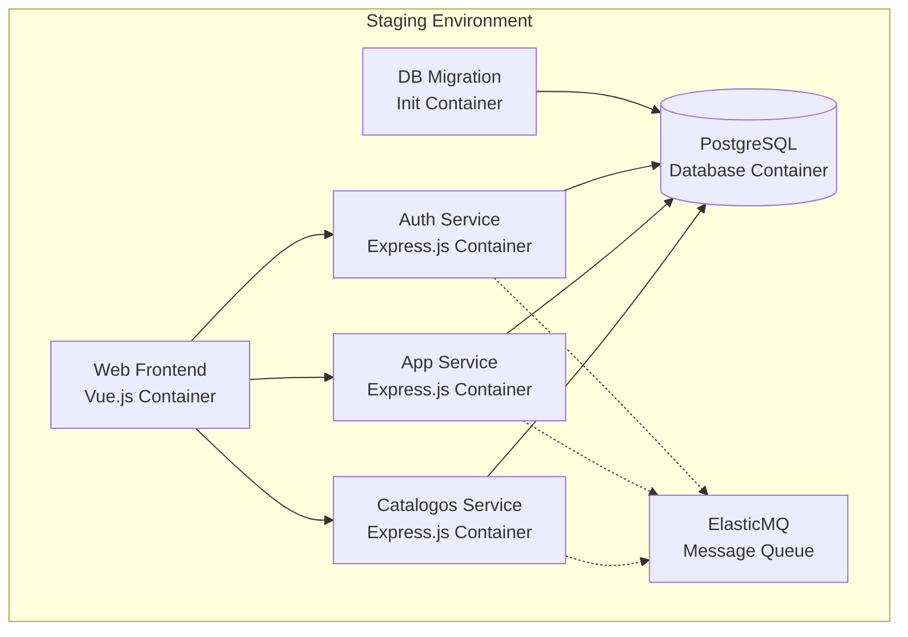

# Staging Environment Docker Setup

This document describes the staging environment configuration for the Chinook Admin Application, which provides full containerization of all services with PostgreSQL database.

## Overview

The staging environment runs all services in Docker containers:
- **Web Frontend**: Vue.js application (containerized)
- **Backend Services**: Auth, App, and Catalogos services (containerized)
- **Database**: PostgreSQL (containerized)
- **Message Queue**: ElasticMQ (containerized)

## Prerequisites

- Docker Engine 20.10+
- Docker Compose 2.0+
- At least 4GB RAM available for containers
- Ports 80, 3000, 3001, 3002, 5432, 9324 available on host

## Quick Start

### 1. Environment Configuration

Create and configure the staging environment file:

```bash
# Copy the template (if it doesn't exist)
cp .env.staging.template .env.staging

# Edit the environment variables
nano .env.staging  # or your preferred editor
```

**Important**: Update these critical values in `.env.staging`:
- `JWT_SECREAT_KEY`: Use a secure, random string
- `DB_PASSWORD`: Use a strong password for PostgreSQL

### 2. Start Staging Environment

**Linux/macOS:**
```bash
./docker-run.staging.sh
```

**Windows (PowerShell):**
```powershell
.\docker-run.staging.ps1
```

**Manual Docker Compose:**
```bash
docker-compose -f docker-compose.staging.yml --env-file .env.staging up -d --build
```

### 3. Access Services

Once all services are healthy:
- **Web Application**: http://localhost:80
- **Auth Service**: http://localhost:3000
- **App Service**: http://localhost:3001
- **Catalogos Service**: http://localhost:3002
- **PostgreSQL**: localhost:5432
- **ElasticMQ**: http://localhost:9324

## Service Architecture

### Service Dependencies



### Startup Order

1. **PostgreSQL** starts first with health checks
2. **Database Migration** runs after PostgreSQL is healthy
3. **Backend Services** (Auth, App, Catalogos) start after migration completes
4. **Web Frontend** starts after all backend services are healthy
5. **ElasticMQ** starts independently

## Configuration Details

### Environment Variables

The staging environment uses the following key configurations:

#### Database Configuration
```env
DB_USER=chinook_user
DB_PASSWORD=secure_staging_password_change_me
POSTGRES_DB=chinook
DB_HOST=postgres
DB_PORT=5432
```

#### Service Communication
```env
# Internal Docker network URLs
AUTH_SERVICE_URL=http://auth:3000
APP_SERVICE_URL=http://app:3001
CATALOGOS_SERVICE_URL=http://catalogos:3002
```

#### Web Frontend Configuration
```env
VITE_MODE=staging
VITE_BASE_URL=http://app:3001
VITE_URL_AUTH=http://auth:3000
VITE_CATALOGOS_URL=http://catalogos:3002
```

### Network Configuration

- **Network Name**: `chinook-staging-network`
- **Subnet**: `172.20.0.0/16`
- **Driver**: Bridge
- **Internal Communication**: Services communicate using container names

### Volume Configuration

- **PostgreSQL Data**: `chinook_postgres_staging_data`
- **Persistence**: Database data persists between container restarts
- **Backup**: Volume can be backed up using Docker volume commands

## Management Commands

### Start Services
```bash
# Start all services
docker-compose -f docker-compose.staging.yml --env-file .env.staging up -d

# Start specific service
docker-compose -f docker-compose.staging.yml --env-file .env.staging up -d web
```

### Stop Services
```bash
# Stop all services
docker-compose -f docker-compose.staging.yml --env-file .env.staging down

# Stop and remove volumes (WARNING: This deletes database data)
docker-compose -f docker-compose.staging.yml --env-file .env.staging down -v
```

### View Logs
```bash
# All services
docker-compose -f docker-compose.staging.yml logs -f

# Specific service
docker-compose -f docker-compose.staging.yml logs -f web
docker-compose -f docker-compose.staging.yml logs -f auth
docker-compose -f docker-compose.staging.yml logs -f app
docker-compose -f docker-compose.staging.yml logs -f catalogos
docker-compose -f docker-compose.staging.yml logs -f postgres
```

### Check Service Status
```bash
# Container status
docker-compose -f docker-compose.staging.yml ps

# Service health
docker-compose -f docker-compose.staging.yml ps --format table
```

### Database Management

#### Connect to PostgreSQL
```bash
# Using docker exec
docker exec -it chinook-postgres-staging psql -U chinook_user -d chinook

# Using local psql client
psql -h localhost -p 5432 -U chinook_user -d chinook
```

#### Database Backup
```bash
# Create backup
docker exec chinook-postgres-staging pg_dump -U chinook_user chinook > backup_$(date +%Y%m%d_%H%M%S).sql

# Restore backup
docker exec -i chinook-postgres-staging psql -U chinook_user -d chinook < backup_file.sql
```

#### Run Migrations Manually
```bash
# Run migration container
docker-compose -f docker-compose.staging.yml --env-file .env.staging run --rm db-migrate
```

## Troubleshooting

### Common Issues

#### Services Not Starting
1. Check if ports are available:
   ```bash
   netstat -tulpn | grep -E ':(80|3000|3001|3002|5432|9324)'
   ```

2. Check Docker resources:
   ```bash
   docker system df
   docker system prune  # Clean up if needed
   ```

#### Database Connection Issues
1. Verify PostgreSQL is healthy:
   ```bash
   docker-compose -f docker-compose.staging.yml ps postgres
   ```

2. Check database logs:
   ```bash
   docker-compose -f docker-compose.staging.yml logs postgres
   ```

3. Test database connection:
   ```bash
   docker exec chinook-postgres-staging pg_isready -U chinook_user
   ```

#### Service Communication Issues
1. Check network connectivity:
   ```bash
   docker network ls
   docker network inspect chinook-staging-network
   ```

2. Test service endpoints:
   ```bash
   # From inside a container
   docker exec chinook-web-staging curl -f http://auth:3000/health
   ```

#### Web Frontend Issues
1. Check if Vite dev server is running:
   ```bash
   docker-compose -f docker-compose.staging.yml logs web
   ```

2. Verify environment variables:
   ```bash
   docker exec chinook-web-staging env | grep VITE_
   ```

### Performance Optimization

#### Container Resources
```yaml
# Add to service definitions for resource limits
deploy:
  resources:
    limits:
      memory: 512M
      cpus: '0.5'
    reservations:
      memory: 256M
      cpus: '0.25'
```

#### PostgreSQL Tuning
The PostgreSQL container includes optimized settings for staging:
- `shared_buffers=256MB`
- `effective_cache_size=1GB`
- `max_connections=100`

### Security Considerations

1. **Change Default Passwords**: Update `JWT_SECREAT_KEY` and `DB_PASSWORD`
2. **Network Isolation**: Services communicate only within Docker network
3. **Non-root Users**: Backend services run as non-root users
4. **Health Checks**: All services include health monitoring
5. **Resource Limits**: Consider adding resource constraints for production

## Development vs Staging

| Aspect | Development | Staging |
|--------|-------------|---------|
| Backend Services | Local (non-containerized) | Containerized |
| Database | SQLite (local files) | PostgreSQL (container) |
| Web Frontend | Containerized | Containerized |
| Service Communication | host.docker.internal | Internal Docker network |
| Environment | Mixed local/container | Full containerization |
| Data Persistence | Local .db/ files | Docker volumes |

## Migration from Development

To migrate from development to staging environment:

1. **Export Development Data** (if needed):
   ```bash
   # Export SQLite data
   sqlite3 .db/app.sqlite3 .dump > app_data.sql
   sqlite3 .db/auth.sqlite3 .dump > auth_data.sql
   sqlite3 .db/catalogos.sqlite3 .dump > catalogos_data.sql
   ```

2. **Start Staging Environment**:
   ```bash
   ./docker-run.staging.sh
   ```

3. **Import Data** (if needed):
   ```bash
   # Convert and import to PostgreSQL
   # (This requires manual conversion from SQLite to PostgreSQL format)
   ```

## Next Steps

After setting up staging, consider:
1. Setting up production environment (`docker-compose.prod.yml`)
2. Implementing CI/CD pipelines
3. Adding monitoring and logging solutions
4. Setting up automated backups
5. Implementing secrets management